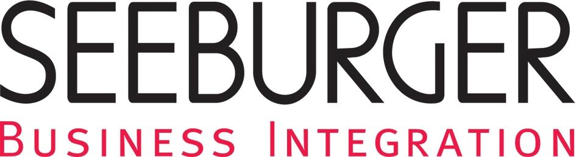

[](https://www.versioneye.com/user/projects/57471a39ce8d0e004505f63c)

# VersionEye

This is the source code for the web application [VersionEye](https://www.versioneye.com).

## Sponsors

This companies are financially supporting VersionEye. 

<table>
	<tr>
		<td>
			<a href="https://www.jfrog.com/">
				
			</a>
		</td>
		<td>
			<a href="https://www.xing.com/">
				
			</a>
		</td>
		<td>
			<a href="http://www.seeburger.de/">
				
			</a>
		</td>
	</tr>
</table>


## Start the backend services for VersionEye

This project contains a [docker-compose.yml](docker-compose.yml) file which describes the backend services
of VersionEye. You can start the backend services like this:

```
docker-compose up -d
```

That will start:

 - MongoDB
 - RabbitMQ
 - ElasticSearch
 - Memcached

For persistence you should comment in and adjust the mount volumes in [docker-compose.yml](docker-compose.yml)
for MongoDB and ElasticSearch. If you are not interested in persisting the data on your host you can
let it untouched.

Shutting down the backend services works like this:

```
docker-compose down
```

## Configuration

All important configuration values are read from environment variable. Before you start
VersioneyeCore.new you should adjust the values in [scripts/set_vars_for_dev.sh](scripts/set_vars_for_dev.sh)
and load them like this:

```
source ./scripts/set_vars_for_dev.sh
```

The most important env. variables are the ones for the backend services, which point to MongoDB, ElasticSearch,
RabbitMQ and Memcached.

## Install dependencies

If the backend services are all up and running and the environment variables are set correctly
you can install the dependencies with `bundler`. If `bundler` is not installed on your machine
run this command to install it:

```
gem install bundler
```

Then you can install the dependencies like this:

```
bundle install
```

## Rails Server

If the dependencies are installed correctly you can start the Rails server like this:

```
rails s
```

Now the application should be available at `http://localhost:3000`.

## Amazon S3

You can use the fake-s3 GEM to simulate S3 offline: <https://github.com/jubos/fake-s3>.
You can start the fake-s3 service like this:

```
fakes3 -r /tmp -p 4567
```

## React.JS

Some parts of VersionEye are implemented in ReactJS.
For autocompiling the JSX files in ReactJS use the `jsx` node package.

```
jsx --watch src/ build/
```

`jsx` can be installed via NPM with this command:

```
sudo npm install -g react-tools
```

## Tests

The tests for this project are running after each `git push` on [CircleCI](https://circleci.com/gh/versioneye/versioneye)!
For more details take a look to the [circle.yml](circle.yml) file in the root directory!

If the Docker containers for the backend services are running locally, the tests can be executed locally
with this command:

```
./scripts/runtests_local.sh
```

Make sure that you followed the steps in the configuration section, before you run the tests!

## Support

For commercial support send a message to `support@versioneye.com`.

## License

VersionEye-Core is licensed under the MIT license!

Copyright (c) 2016 VersionEye GmbH

Permission is hereby granted, free of charge, to any person obtaining a copy
of this software and associated documentation files (the "Software"), to deal
in the Software without restriction, including without limitation the rights
to use, copy, modify, merge, publish, distribute, sublicense, and/or sell
copies of the Software, and to permit persons to whom the Software is
furnished to do so, subject to the following conditions:

The above copyright notice and this permission notice shall be included in all
copies or substantial portions of the Software.

THE SOFTWARE IS PROVIDED "AS IS", WITHOUT WARRANTY OF ANY KIND, EXPRESS OR
IMPLIED, INCLUDING BUT NOT LIMITED TO THE WARRANTIES OF MERCHANTABILITY,
FITNESS FOR A PARTICULAR PURPOSE AND NONINFRINGEMENT. IN NO EVENT SHALL THE
AUTHORS OR COPYRIGHT HOLDERS BE LIABLE FOR ANY CLAIM, DAMAGES OR OTHER
LIABILITY, WHETHER IN AN ACTION OF CONTRACT, TORT OR OTHERWISE, ARISING FROM,
OUT OF OR IN CONNECTION WITH THE SOFTWARE OR THE USE OR OTHER DEALINGS IN THE
SOFTWARE.
